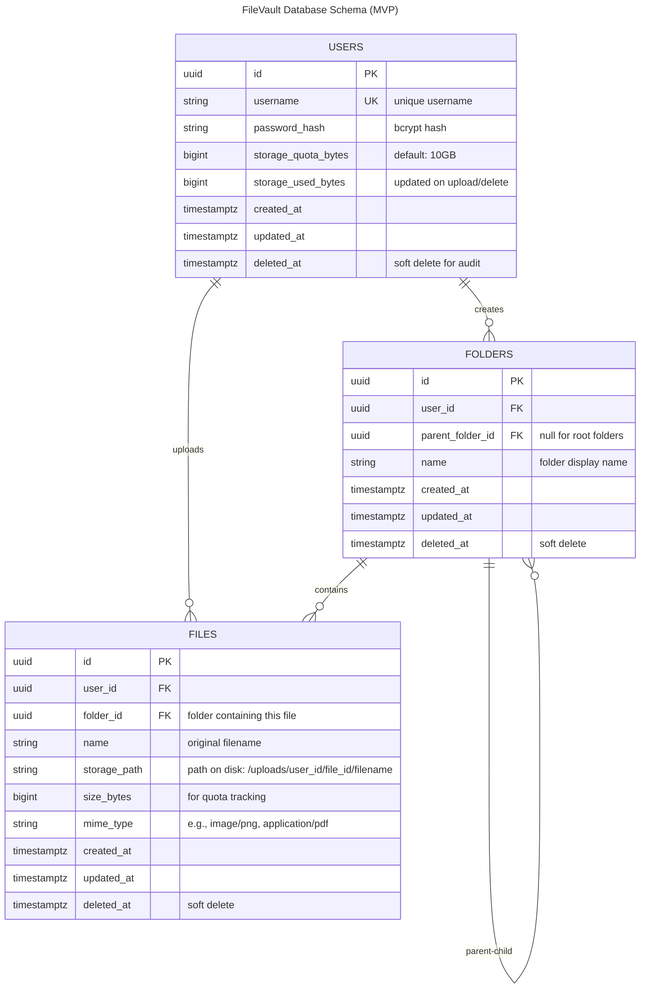

# Entity Relationship Diagram

## FileVault Database Schema

This diagram shows the database schema for the FileVault file storage system MVP.



## Schema Details

### Users Table
- **Purpose**: Store user accounts and authentication data
- **Primary Key**: `id` (UUID)
- **Unique Constraint**: `username` (case-insensitive)
- **Key Fields**:
  - `password_hash`: Bcrypt hash (never store plaintext passwords)
  - `storage_quota_bytes`: Total storage allowed (default 10 GB)
  - `storage_used_bytes`: Current usage (updated on every upload/delete)
  - `deleted_at`: Soft deletion for audit trail

### Folders Table
- **Purpose**: Hierarchical organization of files
- **Primary Key**: `id` (UUID)
- **Foreign Keys**:
  - `user_id` → Users (folder owner)
  - `parent_folder_id` → Folders (self-referencing for hierarchy)
- **Key Fields**:
  - `name`: Folder display name (unique within parent)
  - `parent_folder_id`: NULL for root-level folders
  - Supports unlimited nesting depth
- **Indexes**: Should have composite index on (user_id, parent_folder_id) for fast listing

### Files Table
- **Purpose**: Store file metadata and storage references
- **Primary Key**: `id` (UUID)
- **Foreign Keys**:
  - `user_id` → Users (file owner)
  - `folder_id` → Folders (direct parent folder)
- **Key Fields**:
  - `name`: Original filename (e.g., "document.pdf")
  - `storage_path`: Disk location (e.g., "/uploads/user123/file456/document.pdf")
  - `size_bytes`: Used for storage quota calculation
  - `mime_type`: Content type for downloads (e.g., "application/pdf")
  - `deleted_at`: Soft deletion (don't hard-delete for audit)
- **Indexes**: Composite on (user_id, folder_id, deleted_at) for fast filtering

## Relationships

### USERS → FOLDERS (1:Many)
- One user can create many folders
- Relationship: `USERS ||--o{ FOLDERS : creates`

### USERS → FILES (1:Many)
- One user can upload many files
- Relationship: `USERS ||--o{ FILES : uploads`

### FOLDERS → FILES (1:Many)
- One folder can contain many files
- Relationship: `FOLDERS ||--o{ FILES : contains`

### FOLDERS → FOLDERS (1:Many Self-Referencing)
- One folder can have many child folders (hierarchical structure)
- Relationship: `FOLDERS ||--o{ FOLDERS : "parent-child"`
- Example: "My Drive > Projects > 2026 > Q1"

## Storage Path Convention

Files are stored on disk using this structure:

```
/uploads/
  {user_id}/
    {file_id}/
      {original_filename}
```

**Example:**
```
/uploads/
  550e8400-e29b-41d4-a716-446655440000/  (user UUID)
    123e4567-e89b-12d3-a456-426614174000/  (file UUID)
      budget-2026.xlsx
```

**Rationale:**
- Prevents filename collisions across users
- Allows file deduplication by hash (future optimization)
- Simplifies hard-delete operations (remove directory recursively)
- Supports easy backup/restore by user or file

## Indexing Strategy (Performance)

Recommended indexes for MVP:

```sql
-- Fast file listing per folder
CREATE INDEX idx_files_user_folder ON files (user_id, folder_id, deleted_at);

-- Fast recursive folder navigation
CREATE INDEX idx_folders_user_parent ON folders (user_id, parent_folder_id, deleted_at);

-- Fast login
CREATE UNIQUE INDEX idx_users_username ON users (LOWER(username));

-- Quota calculation
CREATE INDEX idx_files_user_deleted ON files (user_id, deleted_at, size_bytes);
```

## Soft Deletion

All tables use `deleted_at` timestamp for soft deletion:
- **Benefits**:
  - Audit trail: Can see what was deleted when
  - Accidental deletion recovery (future)
  - Compliance: GDPR data retention policies
- **Cost**: All queries must filter `WHERE deleted_at IS NULL`
- **Migration**: Use database triggers to auto-purge after 90 days (future)

## Future Schema Changes (Post-MVP)

1. **File Sharing** (Phase 2):
   - Add `public_link_shares` table for shared links
   - Add `share_permissions` table for team access

2. **Version History** (Phase 3):
   - Add `file_versions` table with version chain
   - Store previous file contents in separate location

3. **Tags & Metadata** (Phase 3):
   - Add `file_tags` junction table
   - Add `file_metadata` for custom properties

4. **Activity Audit** (Phase 2):
   - Add `audit_log` table for compliance
   - Track user actions (upload, delete, share, download)

5. **Notifications** (Phase 2):
   - Add `notifications` table for user alerts
   - Add `notification_settings` for user preferences

## Constraints

### Data Type Choices
- **UUIDs** for all IDs (globally unique, secure, suitable for sharding)
- **bigint** for file sizes (supports up to 8 EB per file)
- **timestamptz** for all timestamps (always store time zones)
- **string** for text (no length restrictions for MVP; enforce in application)

### Cardinality Notes
- Users can have 0 folders (privacy-conscious users)
- Users can have 0 files (new accounts)
- Root folders have `parent_folder_id = NULL`
- Files without a folder belong to the root (implicit)
- Files always belong to exactly one user and one folder

### Referential Integrity
- Deleting a user should cascade delete all folders and files (soft delete)
- Deleting a folder should cascade delete all child items
- Foreign key constraints enforced at database level
