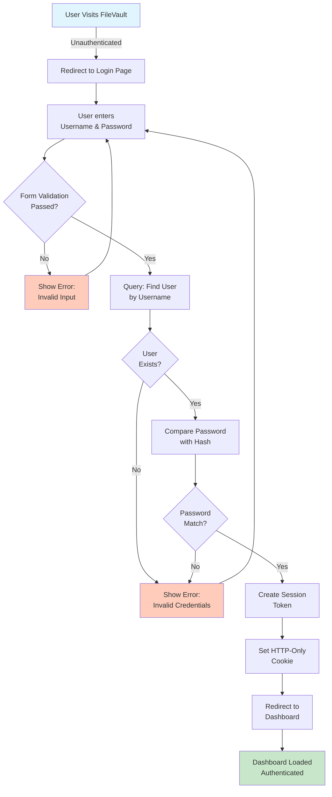
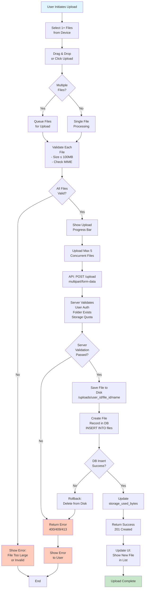
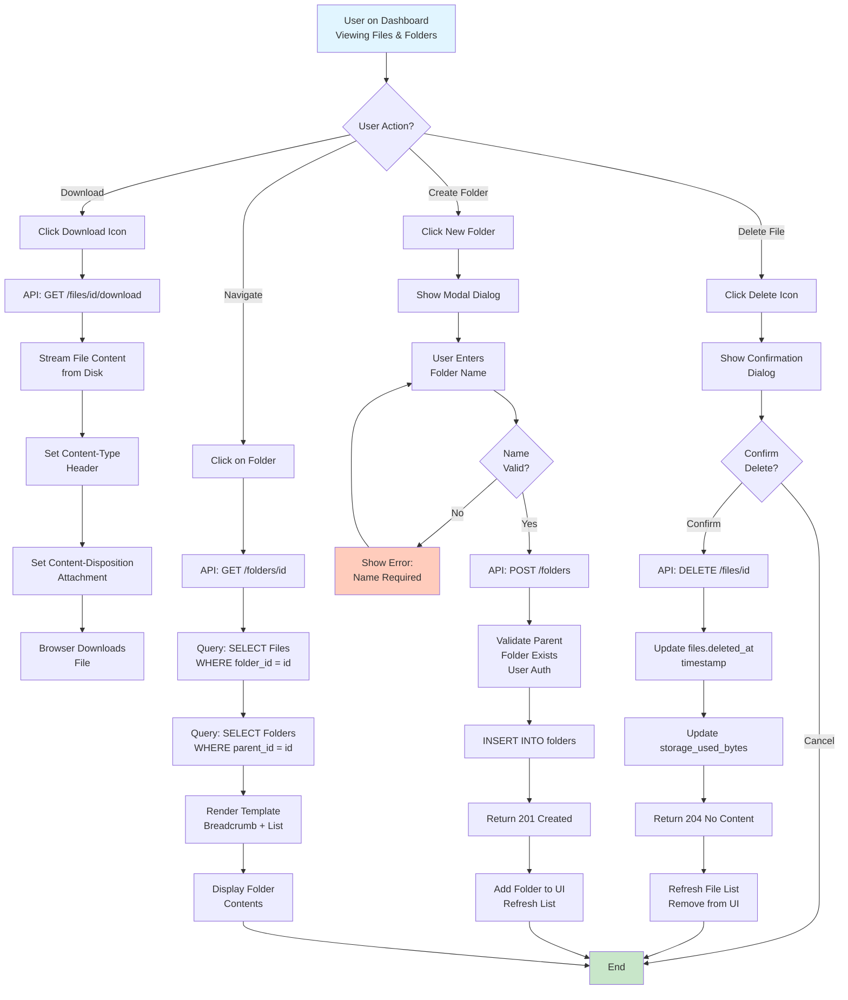
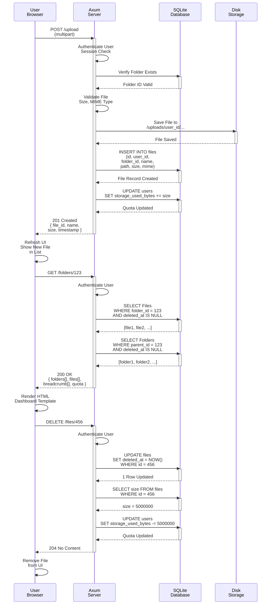
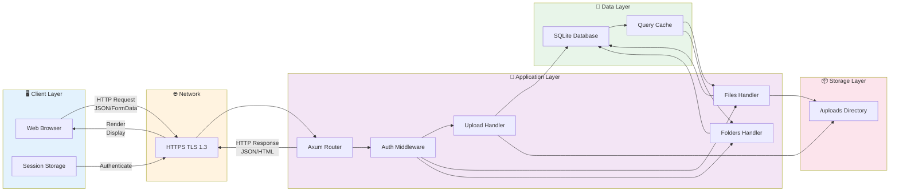
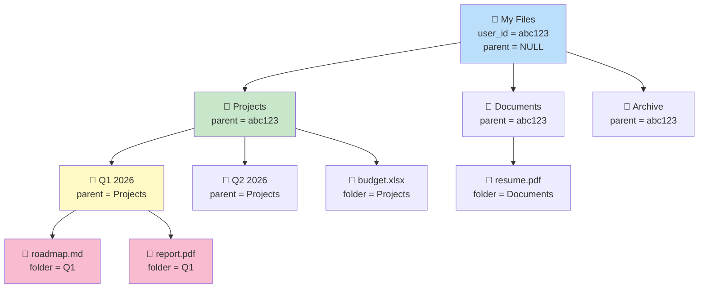
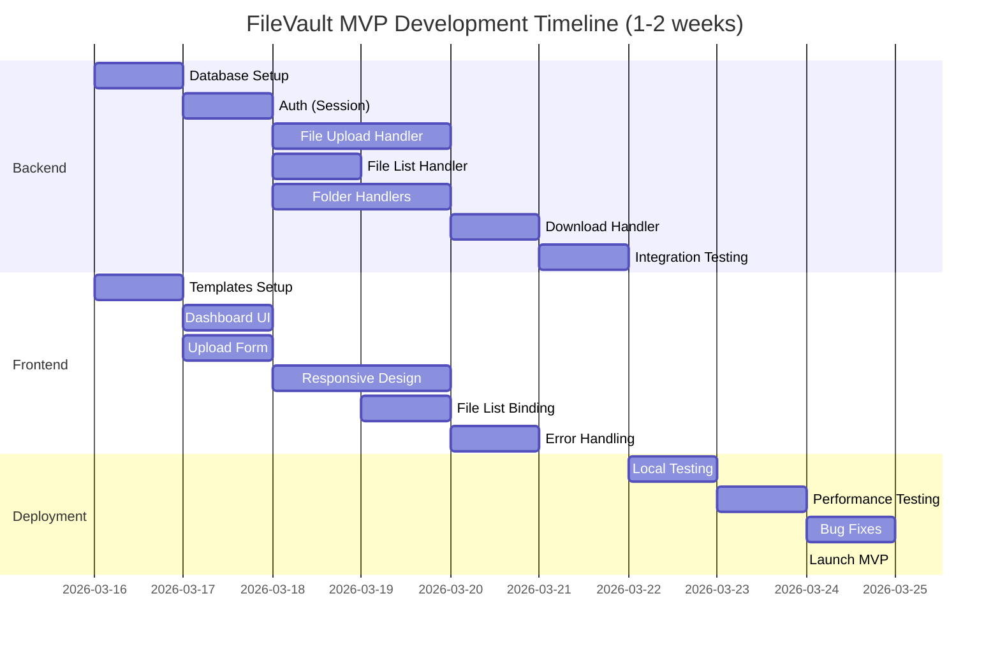

# Process Flow Diagrams

## 1. User Authentication Flow

## 2. File Upload Flow

## 3. File Management Operations

## 4. MVP User Journey

```mermaid
flowchart TD
    A["👤 New User<br/>Day 1"] --> B["Visit filevault.com"]
    B --> C["Land on Login<br/>Page"]
    C --> D{Has<br/>Account?}
    D -->|No| E["(Post-MVP:<br/>Signup)"]
    E --> F["Create Account"]
    D -->|Yes| G["Enter Credentials"]
    F --> H["Log In"]
    G --> H
    H --> I["✅ Log In Success<br/>Day 1"]
    I --> J["See Dashboard<br/>Empty Folder"]
    J --> K["📤 Upload 1st File<br/>Day 1"]
    K --> L["Select File<br/>from Device"]
    L --> M["File Uploaded"]
    M --> N["✅ File Visible<br/>in List<br/>Day 1"]
    N --> O["📁 Create Folder<br/>Day 2"]
    O --> P["Type Folder Name<br/>Documents"]
    P --> Q["Folder Created"]
    Q --> R["✅ Navigate<br/>into Folder<br/>Day 2"]
    R --> S["Folder Empty"]
    S --> T["📤 Upload to<br/>Folder<br/>Day 2"]
    T --> U["Upload More Files"]
    U --> V["✅ Folder<br/>Contains Files<br/>Day 2"]
    V --> W["📥 Download File<br/>Day 3"]
    W --> X["Click Download"]
    X --> Y["File Downloaded<br/>to Device"]
    Y --> Z["✅ File on<br/>Local Device<br/>Day 3"]
    Z --> AA["🗑️ Delete File<br/>Day 4"]
    AA --> AB["Confirm Delete"]
    AB --> AC["File Removed"]
    AC --> AD["✅ File Gone<br/>from List<br/>Day 4"]
    AD --> AE["MVP Complete ✓"]
    
    style A fill:#e3f2fd
    style I fill:#c8e6c9
    style N fill:#c8e6c9
    style R fill:#c8e6c9
    style V fill:#c8e6c9
    style Z fill:#c8e6c9
    style AD fill:#c8e6c9
    style AE fill:#a5d6a7
```

## 5. API Request/Response Cycle

## 6. System Architecture Diagram

## 7. Folder Hierarchy Example

## 8. MVP Development Timeline

## Key Process Insights

### Upload Safety
- **Atomic Operations**: File written to disk AND database record created together
- **Rollback**: If DB fails, file is deleted from disk
- **Concurrency**: Max 5 uploads per user to prevent overload

### File Deletion
- **Soft Delete**: Mark `deleted_at` instead of hard delete (audit trail)
- **Quota Release**: Free storage immediately
- **Recovery**: Can restore deleted files within 90 days (Post-MVP)

### Folder Navigation
- **Breadcrumb**: Show path: "My Files > Projects > Q1 2026"
- **Parent-Child**: Self-referencing relationship supports unlimited nesting
- **Root Handling**: NULL parent_id represents root level

### Authentication
- **Session-Based**: HTTP-only cookies prevent XSS access
- **Token Expiry**: 30 days of inactivity
- **HTTPS Mandatory**: TLS 1.3 encrypts all traffic

### Performance Optimizations
- **Caching**: Cache folder listings and user quota
- **Pagination**: Show 50 items per page
- **Indexing**: Composite indexes on (user_id, parent/folder_id, deleted_at)
- **Async I/O**: Tokio handles concurrent uploads efficiently
